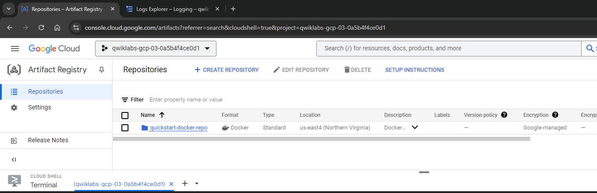
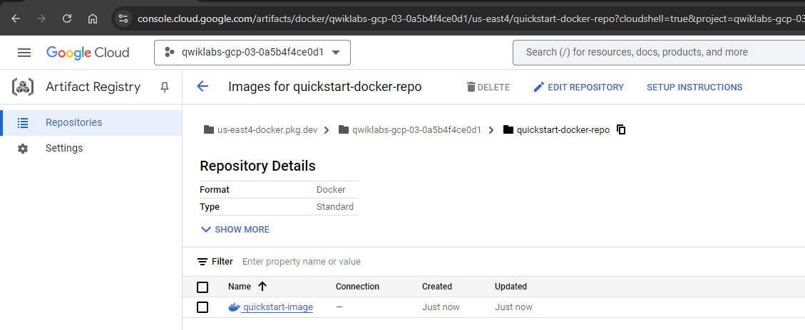
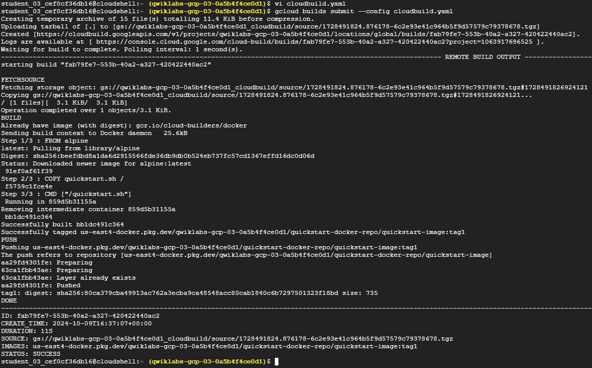
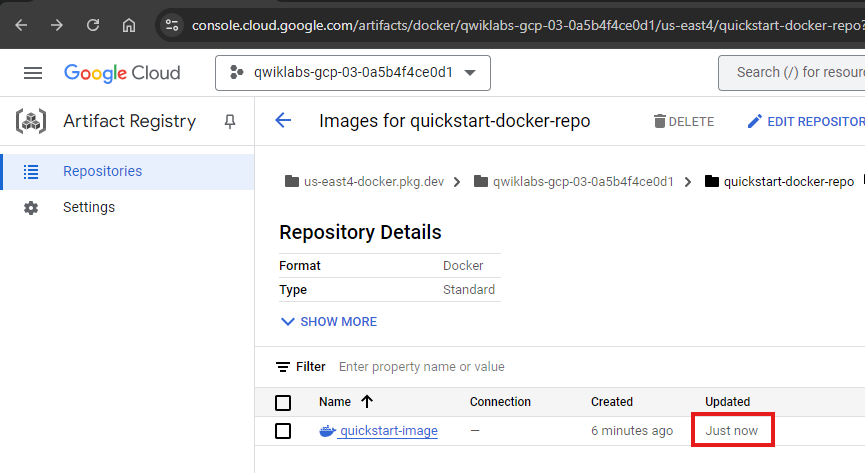
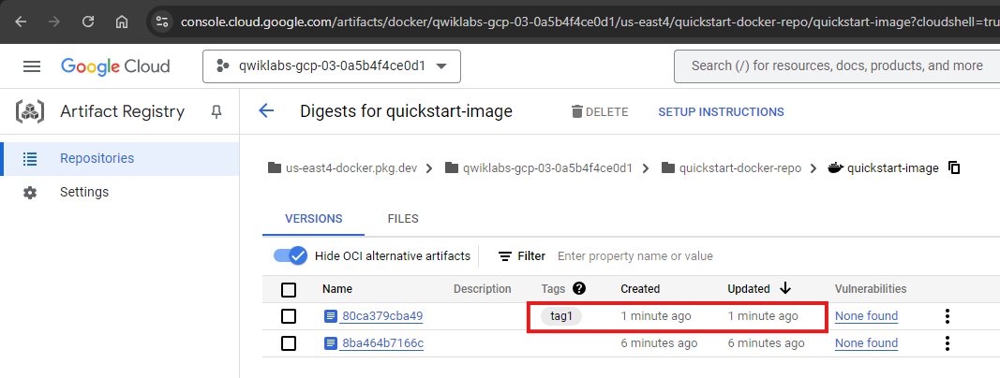
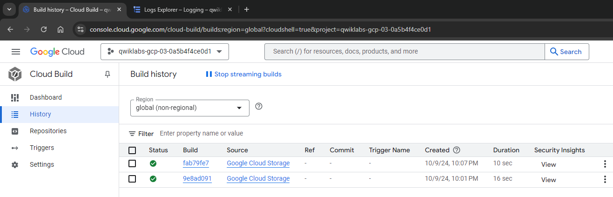
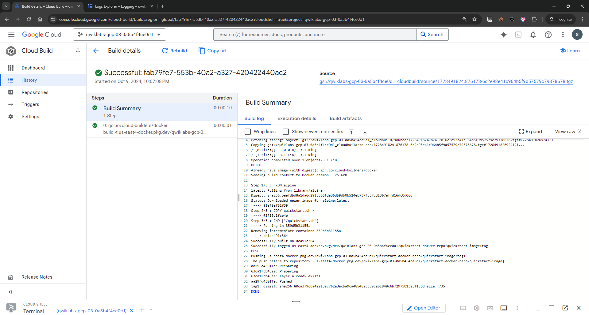

## Containers and Kubernetes


Step1. Confirming the needed APIs are enabled.

```

```

Step2. Build containers with Dockerfile and Cloud Build

```shell
vi quickstart.sh
```

add following lines in `quickstart.sh`
```shell
#!/bin/sh

echo "Hello there! the time is $(date)."

```
Create `Dockerfile` file    
```
vi Dockerfile
```

```Dockerfile
FROM alpine      #This instructs the build to use the Alpine Linux base image.
COPY quickstart.sh #This instructs the build to use the Alpine Linux base image.
CMD ["/quickstart.sh"]  ## This adds the quickstart.sh script to the / directory in the image.

```

```shell
chmod +x quickstart.sh   ## making the quickstart.sh script executable
```

Create a new Docker repository named quickstart-docker-repo in the location us-east4 with the description "Docker repository"

```shell
gcloud artifacts repositories create quickstart-docker-repo --repository-format=docker \
    --location=us-east4 --description="Docker repository"
```

Created Image can be view in Artifact Registery


Building the Docker container image in Cloud Build, using Cloud Shell

```shell
gcloud builds submit --tag us-east4-docker.pkg.dev/${DEVSHELL_PROJECT_ID}/quickstart-docker-repo/quickstart-image:tag1
```

When the build completes, your Docker image is built and pushed to the Artifact Registry.



Step 3. Building containers with a build configuration file and Cloud Build

```yaml
steps:
- name: 'gcr.io/cloud-builders/docker'
  args: [ 'build', '-t', '[YourRegionHere]-docker.pkg.dev/$PROJECT_ID/quickstart-docker-repo/quickstart-image:tag1', '.' ]
images:
- '[YourRegionHere]-docker.pkg.dev/$PROJECT_ID/quickstart-docker-repo/quickstart-image:tag1'
```

replace `YourRegionHere` with `us-east4`

```yaml
    steps:
    - name: 'gcr.io/cloud-builders/docker'
    args: [ 'build', '-t', 'us-east4-docker.pkg.dev/$PROJECT_ID/quickstart-docker-repo/quickstart-image:tag1', '.' ]
    images:
    - 'us-east4-docker.pkg.dev/$PROJECT_ID/quickstart-docker-repo/quickstart-image:tag1'
```
This file instructs Cloud Build to use Docker to build an image using the Dockerfile specification in the current local directory, tag it with `gcr.io/$PROJECT_ID/quickstart-image ($PROJECT_ID` is a substitution variable automatically populated by Cloud Build with the project ID of the associated project), and then push that image to Artifact Registry

In Cloud Shell, execute the following command to start a Cloud Build using cloudbuild.yaml as the build configuration file:

```shell
gcloud builds submit --config cloudbuild.yaml
```






In the Google Cloud console, in the Search Bar (Located at the top of the console window), Search for Cloud Build.

In search results, click Cloud Build.



In Cloud Build, click History. Two builds appear in the list.

Click the build ID for the build at the top of the list. The details of the build, including the build log, are displayed.



Step 4. Building and testing containers with a build configuration file and Cloud Build

The true power of custom build configuration files is their ability to perform other actions, in parallel or in sequence, in addition to simply building containers: running tests on your newly built containers, pushing them to various destinations, and even deploying them to Kubernetes Engine.

```shell
vi quickstart.sh
```
```shell
#!/bin/sh
if [ -z "$1" ]
then
	echo "Hello, world! The time is $(date)."
	exit 0
else
	exit 1
fi
```

```
vi cloudbuild2.yaml
```

```yaml
steps:
- name: 'gcr.io/cloud-builders/docker'
  args: [ 'build', '-t', 'us-east4-docker.pkg.dev/$PROJECT_ID/quickstart-docker-repo/quickstart-image:tag1', '.' ]
- name: 'us-east4-docker.pkg.dev/$PROJECT_ID/quickstart-docker-repo/quickstart-image:tag1'
  args: ['fail']
images:
- 'us-east4-docker.pkg.dev/$PROJECT_ID/quickstart-docker-repo/quickstart-image:tag1'
```
In addition to its previous actions, this build configuration file runs the `quickstart-image` it has created. In this task, the `quickstart.sh` script has been modified so that it simulates a test failure when an argument `['fail']` is passed to it.


Being in cloud Shell run this command, to start a Cloud Build using `cloudbuild.yaml` as the build configuration file
```shell
gcloud builds submit --config cloudbuild2.yaml
```


