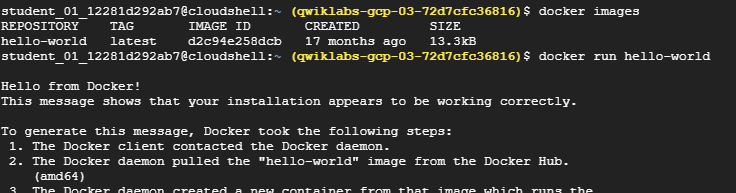
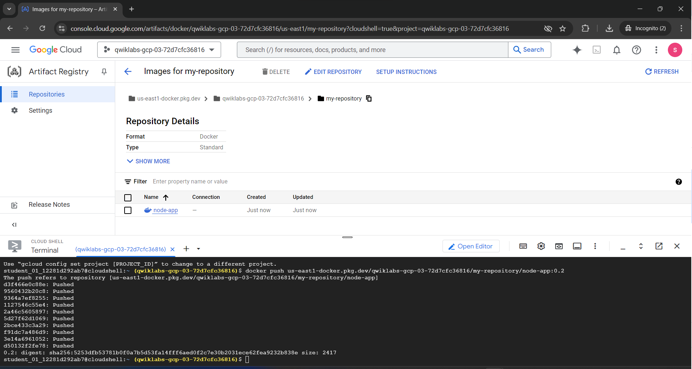

```shell
gcloud auth list
```


To list the project configuration:
```shell
gcloud config list project
```


If the image is already present, it won't be downloaded from DockerHub Registry.


To check if the containers are running:
```shell
docker ps
```


To check all containers, including those that are not running:
```shell
docker ps -a
```


## Packaging an App in a Container

First, create a Dockerfile, then build an image from it. Finally, deploy the app in a container using that image.

```Dockerfile
cat > Dockerfile <<EOF
# Use an official Node runtime as the parent image
FROM node:lts

# Set the working directory in the container to /app
WORKDIR /app

# Copy the current directory contents into the container at /app
ADD . /app

# Make the container's port 80 available to the outside world
EXPOSE 80

# Run app.js using node when the container launches
CMD ["node", "app.js"]
EOF
```

```javascript
cat > app.js << EOF;
const http = require("http");

const hostname = "0.0.0.0";
const port = 80;

const server = http.createServer((req, res) => {
        res.statusCode = 200;
        res.setHeader("Content-Type", "text/plain");
        res.end("Hello World\n");
});

server.listen(port, hostname, () => {
        console.log("Server running at http://%s:%s/", hostname, port);
});

process.on("SIGINT", function () {
        console.log("Caught interrupt signal and will exit");
        process.exit();
});
EOF

```

```shell
 docker build -t node-app:0.1 .
```

```
docker images
```
```
docker run -p 4000:80 --name my-app node-app:0.1
```
```output
fc6fe0ceec46f092d758c6dadc3ec6a359bb354c506d80648f6802cc0bc4a0c1
```
```
docker ps
```


using detached mode
```
docker run -p 4000:80 --name my-app -d node-app:0.1
```


# lets create an Artifact Repository.
```shell
gcloud artifacts repositories create my-repository --repository-format=docker --location=us-east1 --description="Docker repository"
```


Lets push the container to artifact registry

```
cd ~/test
```
to get the full artfactory path copy above path, 


```

docker build -t us-east1-docker.pkg.dev/qwiklabs-gcp-03-72d7cfc36816/my-repository/node-app:0.2 .
```
```
docker images
```


Pushing this image to Artifact Registry.

```bash
docker push us-east1-docker.pkg.dev/qwiklabs-gcp-03-72d7cfc36816/my-repository/node-app:0.2
```


After the push finishes, from the Navigation Menu, under **CI/CD** navigate to **Artifact Registry** > **Repositories**.

Click on my-repository. You should see your node-app Docker container created:


Test the image
To simulate a fresh environment, we can either start a new VM, SSH into it, and install gcloud, or simply remove all containers and images.

Stop and remove all containers:
```shell
docker stop $(docker ps -q)
docker rm $(docker ps -aq)
```


We must remove child images of `node:lts` before removing the `node` image.


Run this command to remove all Docker images:
```shell
docker rmi us-east1-docker.pkg.dev/qwiklabs-gcp-03-72d7cfc36816/my-repository/node-app:0.2
docker rmi node:lts
docker rmi -f $(docker images -aq) # remove remaining images
docker images
```

(Command Output)

```
REPOSITORY          TAG                 IMAGE ID            CREATED             SIZE
```

At this point, you should have a pseudo-fresh environment.

Pull the image and run it:
```shell
docker run -p 4000:80 -d us-east1-docker.pkg.dev/qwiklabs-gcp-03-72d7cfc36816/my-repository/node-app:0.2
```

Run a curl against the running container:
```shell
curl http://localhost:4000
```

(Command Output)

```
Welcome to Cloud
```