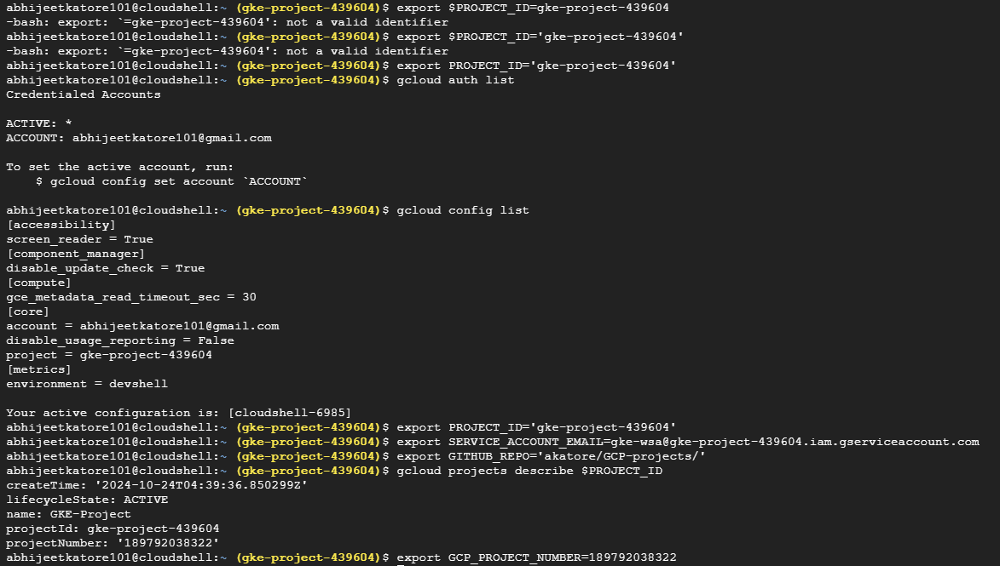

# [Complete CI/CD with Kubernetes/Docker, Terraform and GKE(Google Kubernetes Engine)](https://github.com/akatore/ci-cd-with-terraform-kubernetes-on-gcp)
### Tech used:
- Flask
- Docker
- GCR(Google Container Registry)
- Terraform
- Kubernetes
- GitHub Actions
- GKE(Google Kubernetes Engine)


## Step 1. Create a simple flask application.
```py
from flask import Flask

app = Flask(__name__)

@app.route('/')
def main_page():
    return "<h1>Welcome to the Main Page</h1><p>This is the homepage of our Flask app.</p>"

@app.route('/about')
def about_page():
    return "<h1>About Page</h1><p>This is the about page of our Flask app.</p>"

if __name__ == '__main__':
    app.run(host='0.0.0.0', port=8080)


```
## Step 2. Write Dockerfile for the application
```Dockerfile
FROM python:3.9-slim
WORKDIR /app
COPY . /app
RUN pip install --no-cache-dir -r requirements.txt
EXPOSE 8080
ENV FLASK_ENV=production
CMD ["python", "app.py"]
```
## Step 3. Write Terraform scripts to create GKE Cluster, Deployment and service.
```providers.tf```: use google and kubernetes providers
```sh
terraform {
  required_version = ">= 0.12"
  backend "gcs" {
  }
}
provider "google" {
  project = var.project_id
  region  = var.region
}
provider "kubernetes" {
  host  = google_container_cluster.default.endpoint
  token = data.google_client_config.current.access_token
  client_certificate = base64decode(
    google_container_cluster.default.master_auth[0].client_certificate,
  )
  client_key = base64decode(google_container_cluster.default.master_auth[0].client_key)
  cluster_ca_certificate = base64decode(
    google_container_cluster.default.master_auth[0].cluster_ca_certificate,
  )
}
```
  ```main.tf```: for creating GKE Cluster
  ```sh
  data "google_container_engine_versions" "default" {
    location = "us-central1-c"
  }
  data "google_client_config" "current" {
  }

  resource "google_container_cluster" "default" {
    name               = "my-first-cluster"
    location           = "us-central1-c"
    initial_node_count = 3
    min_master_version = data.google_container_engine_versions.default.latest_master_version

    node_config {
      machine_type = "g1-small"
      disk_size_gb = 32
    }

    provisioner "local-exec" {
      when    = destroy
      command = "sleep 90"
    }
  }
  ```
  ```k8s.tf```: For deployment and service deployment on K8s
  ```sh
  resource "kubernetes_deployment" "name" {
    metadata {
      name = "nodeappdeployment"
      labels = {
        "type" = "backend"
        "app"  = "nodeapp"
      }
    }
    spec {
      replicas = 1
      selector {
        match_labels = {
          "type" = "backend"
          "app"  = "nodeapp"
        }
      }
      template {
        metadata {
          name = "nodeapppod"
          labels = {
            "type" = "backend"
            "app"  = "nodeapp"
          }
        }
        spec {
          container {
            name  = "nodecontainer"
            image = var.container_image
            port {
              container_port = 80
            }
          }
        }
      }
    }
  }
  resource "google_compute_address" "default" {
    name   = "ipforservice"
    region = var.region
  }
  resource "kubernetes_service" "appservice" {
    metadata {
      name = "nodeapp-lb-service"
    }
    spec {
      type             = "LoadBalancer"
      load_balancer_ip = google_compute_address.default.address
      port {
        port        = 80
        target_port = 80
      }
      selector = {
        "type" = "backend"
        "app"  = "nodeapp"
      }
    }
  }
  ```
  ```variables.tf```
  ```sh
  variable "region" {
  }
  variable "project_id" {
  }
  variable "container_image" {
  }
  ```
  ```outputs.tf```
  ```sh
  output "cluster_name" {
    value = google_container_cluster.default.name
  }
  output "cluster_endpoint" {
    value = google_container_cluster.default.endpoint
  }
  output "cluster_location" {
    value = google_container_cluster.default.location
  }
  output "load-balancer-ip" {
    value = google_compute_address.default.address
  }
  ```
## Step 4. Setup Github OIDC Authentication with GCP usin WIF, SA
### Create a new workload Identity pool
```sh
gcloud iam workload-identity-pools create "k8s-pool" \
--project="${PROJECT_ID}" \
--location="global" \
--display-name="k8s Pool"
```
<details> <summary></summary>


</details>

### Create a oidc identity provider for authenticating with Github
```sh
gcloud iam workload-identity-pools providers create-oidc "k8s-provider" \
  --project="${PROJECT_ID}" \
  --location="global" \
  --workload-identity-pool="k8s-pool" \
  --display-name="k8s provider" \
  --attribute-mapping="google.subject=assertion.sub,attribute.repository=assertion.repository,attribute.actor=assertion.actor,attribute.aud=assertion.aud" \
  --issuer-uri="https://token.actions.githubusercontent.com" \
  --attribute-condition="attribute.repository=='akatore/GCP-projects'"
```
<!--

```sh
gcloud iam workload-identity-pools providers create-oidc "k8s-provider" \
--project="${PROJECT_ID}" \
--location="global" \
--workload-identity-pool="k8s-pool" \
--display-name="k8s provider" \
--attribute-mapping="google.subject=assertion.sub,attribute.actor=assertion.actor,attribute.aud=assertion.aud" \
--issuer-uri="https://token.actions.githubusercontent.com"
```
-->


OIDC Idenity Provider created
> 


#### Create a service account with these permissions
```sh
roles/compute.admin
roles/container.admin
roles/container.clusterAdmin
roles/iam.serviceAccountTokenCreator
roles/iam.serviceAccountUser
roles/storage.admin
```

> [create directly using this script](https://github.com/akatore/GCP-projects/blob/main/ci-cd-with-terraform-kubernetes-on-gcp/notes/scipt-to-assign-roles.sh)

> Example Permission added output can be seen below:


```
gcloud iam service-accounts create my-service-account \
  --description="Service account for application access" \
  --display-name="My Service Account" \
  --project="$PROJECT_ID"                                                                                                                                                                                                 
Created service account [my-service-account].
```
```
gcloud iam service-accounts list --project="$PROJECT_ID"                                                                                                             
DISPLAY NAME: My Service Account
EMAIL: my-service-account@gke-project-439604.iam.gserviceaccount.com
DISABLED: False

DISPLAY NAME: gke-wsa
EMAIL: gke-wsa@gke-project-439604.iam.gserviceaccount.com
DISABLED: False

DISPLAY NAME: gke-sa
EMAIL: gke-sa@gke-project-439604.iam.gserviceaccount.com
DISABLED: False
```
```
export SERVICE_ACCOUNT_EMAIL=my-service-account@gke-project-439604.iam.gserviceaccount.com
```
```
gcloud projects add-iam-policy-binding $PROJECT_ID \
  --member="serviceAccount:$SERVICE_ACCOUNT_EMAIL" \
  --role="roles/compute.admin"

gcloud projects add-iam-policy-binding $PROJECT_ID \
  --member="serviceAccount:$SERVICE_ACCOUNT_EMAIL" \
  --role="roles/container.admin"

gcloud projects add-iam-policy-binding $PROJECT_ID \
  --member="serviceAccount:$SERVICE_ACCOUNT_EMAIL" \
  --role="roles/container.clusterAdmin"

gcloud projects add-iam-policy-binding $PROJECT_ID \
  --member="serviceAccount:$SERVICE_ACCOUNT_EMAIL" \
  --role="roles/iam.serviceAccountTokenCreator"

gcloud projects add-iam-policy-binding $PROJECT_ID \
  --member="serviceAccount:$SERVICE_ACCOUNT_EMAIL" \
  --role="roles/iam.serviceAccountUser"

gcloud projects add-iam-policy-binding $PROJECT_ID \
  --member="serviceAccount:$SERVICE_ACCOUNT_EMAIL" \
  --role="roles/storage.admin"
```
Output:
```
Updated IAM policy for project [gke-project-439604].
bindings:
- members:
  - serviceAccount:gke-sa@gke-project-439604.iam.gserviceaccount.com
  role: roles/compute.admin
- members:
  - user:abhijeetkatore101@gmail.com
  role: roles/owner
etag: BwYlMzSMQJM=
version: 1
Updated IAM policy for project [gke-project-439604].
bindings:
- members:
  - serviceAccount:gke-sa@gke-project-439604.iam.gserviceaccount.com
  role: roles/compute.admin
- members:
  - serviceAccount:gke-sa@gke-project-439604.iam.gserviceaccount.com
  role: roles/container.admin
- members:
  - user:abhijeetkatore101@gmail.com
  role: roles/owner
etag: BwYlMzTHIiY=
version: 1
Updated IAM policy for project [gke-project-439604].
bindings:
- members:
  - serviceAccount:gke-sa@gke-project-439604.iam.gserviceaccount.com
  role: roles/compute.admin
- members:
  - serviceAccount:gke-sa@gke-project-439604.iam.gserviceaccount.com
  role: roles/container.admin
- members:
  - serviceAccount:gke-sa@gke-project-439604.iam.gserviceaccount.com
  role: roles/container.clusterAdmin
- members:
  - user:abhijeetkatore101@gmail.com
  role: roles/owner
etag: BwYlMzT5lgE=
version: 1
Updated IAM policy for project [gke-project-439604].
bindings:
- members:
  - serviceAccount:gke-sa@gke-project-439604.iam.gserviceaccount.com
  role: roles/compute.admin
- members:
  - serviceAccount:gke-sa@gke-project-439604.iam.gserviceaccount.com
  role: roles/container.admin
- members:
  - serviceAccount:gke-sa@gke-project-439604.iam.gserviceaccount.com
  role: roles/container.clusterAdmin
- members:
  - serviceAccount:gke-sa@gke-project-439604.iam.gserviceaccount.com
  role: roles/iam.serviceAccountTokenCreator
- members:
  - user:abhijeetkatore101@gmail.com
  role: roles/owner
etag: BwYlMzUdjCM=
version: 1
Updated IAM policy for project [gke-project-439604].
bindings:
- members:
  - serviceAccount:gke-sa@gke-project-439604.iam.gserviceaccount.com
  role: roles/compute.admin
- members:
  - serviceAccount:gke-sa@gke-project-439604.iam.gserviceaccount.com
  role: roles/container.admin
- members:
  - serviceAccount:gke-sa@gke-project-439604.iam.gserviceaccount.com
  role: roles/container.clusterAdmin
- members:
  - serviceAccount:gke-sa@gke-project-439604.iam.gserviceaccount.com
  role: roles/iam.serviceAccountTokenCreator
- members:
  - serviceAccount:gke-sa@gke-project-439604.iam.gserviceaccount.com
  role: roles/iam.serviceAccountUser
- members:
  - user:abhijeetkatore101@gmail.com
  role: roles/owner
etag: BwYlMzVNCM0=
version: 1
Updated IAM policy for project [gke-project-439604].
bindings:
- members:
  - serviceAccount:gke-sa@gke-project-439604.iam.gserviceaccount.com
  role: roles/compute.admin
- members:
  - serviceAccount:gke-sa@gke-project-439604.iam.gserviceaccount.com
  role: roles/container.admin
- members:
  - serviceAccount:gke-sa@gke-project-439604.iam.gserviceaccount.com
  role: roles/container.clusterAdmin
- members:
  - serviceAccount:gke-sa@gke-project-439604.iam.gserviceaccount.com
  role: roles/iam.serviceAccountTokenCreator
- members:
  - serviceAccount:gke-sa@gke-project-439604.iam.gserviceaccount.com
  role: roles/iam.serviceAccountUser
- members:
  - user:abhijeetkatore101@gmail.com
  role: roles/owner
- members:
  - serviceAccount:gke-sa@gke-project-439604.iam.gserviceaccount.com
  role: roles/storage.admin
etag: BwYlMzVyDfM=
version: 1
````

Refresh the IAM policy page to see who(user/SA) has what role access to what resources(compute engine, strorage bucket) 


we have 3 SA out of which we cannot use  as I have deleted the SA(principal on which we assign the resource role access) but we can use other with necessary access roles

### Add IAM Policy bindings with Github repo, Identity provider and service account.
>Adding IAM Policy Binding to a Service Account for Workload Identity
>Allowing External Identity to Impersonate the Service Account

```sh
gcloud iam service-accounts add-iam-policy-binding "${SERVICE_ACCOUNT_EMAIL}" \
--project="${GCP_PROJECT_ID}" \
--role="roles/iam.workloadIdentityUser" \
--member="principalSet://iam.googleapis.com/projects/${GCP_PROJECT_NUMBER}/locations/global/workloadIdentityPools/k8s-pool/attribute.repository/${GITHUB_REPO}"
```





## Step 5. Create a bucket in GCS for storing terraform state file.
## Step 6. Get your GCP Project number for reference.
```sh
gcloud projects describe ${PROJECT_ID}
``` 
## Step 7.  Add secrets to Github Repo
  - GCP_PROJECT_ID
  - GCP_TF_STATE_BUCKET
## Step 8. write GH Actions workflow for deploying our app to GKE using terraform

```yml
name: Deploy to kubernetes
on:
  push:
    branches:
      - "Complete-CI/CD-with-Terraform-GKE"

env:
  GCP_PROJECT_ID: ${{ secrets.GCP_PROJECT_ID }}
  TF_STATE_BUCKET_NAME: ${{ secrets.GCP_TF_STATE_BUCKET }}

jobs:
  deploy:
    runs-on: ubuntu-latest
    env:
      IMAGE_TAG: ${{ github.sha }}

    permissions:
      contents: 'read'
      id-token: 'write'

    steps:
    - uses: 'actions/checkout@v3'
    - id: 'auth'
      name: 'Authenticate to Google Cloud'
      uses: 'google-github-actions/auth@v1'
      with:
        token_format: 'access_token'
        workload_identity_provider: 'projects/886257991781/locations/global/workloadIdentityPools/k8s-pool/providers/k8s-provider'
        service_account: 'tf-gke-test@$GCP_PROJECT_ID.iam.gserviceaccount.com'
    - name: 'Set up Cloud SDK'
      uses: 'google-github-actions/setup-gcloud@v1'
    - name: docker auth
      run: gcloud auth configure-docker
    - run: gcloud auth list
    - name: Build and push docker image
      run: |
        docker build -t us.gcr.io/$GCP_PROJECT_ID/nodeappimage:$IMAGE_TAG .
        docker push us.gcr.io/$GCP_PROJECT_ID/nodeappimage:$IMAGE_TAG
      working-directory: ./nodeapp
    - name: Setup Terraform
      uses: hashicorp/setup-terraform@v2
    - name: Terraform init
      run: terraform init -backend-config="bucket=$TF_STATE_BUCKET_NAME" -backend-config="prefix=test"
      working-directory: ./terraform
    - name: Terraform Plan
      run: |
        terraform plan \
        -var="region=us-central1" \
        -var="project_id=$GCP_PROJECT_ID" \
        -var="container_image=us.gcr.io/$GCP_PROJECT_ID/nodeappimage:$IMAGE_TAG" \
        -out=PLAN
      working-directory: ./terraform
    - name: Terraform Apply
      run: terraform apply PLAN
      working-directory: ./terraform
```
